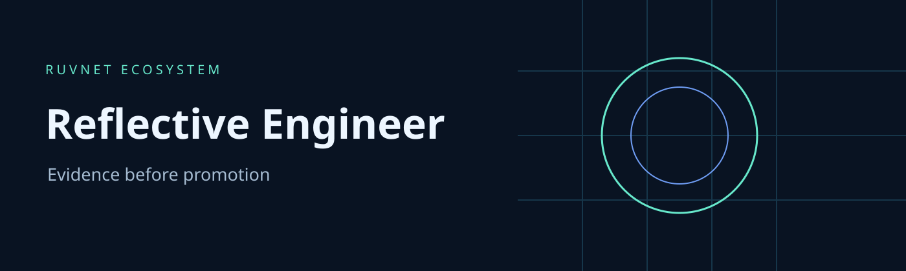

# Reflective Engineer

Reflective Engineer helps you decide whether an agent change deserves approval. Import an experiment report and replay its quality, safety, cost, latency and regression checks in your browser, CLI or MCP host. Your evidence stays on your machine.

This v2 release is an evidence review console. It does not execute agents, authenticate imported measurements or deploy changes. The historical React prompt builder remains in `src/` for migration reference and is excluded from the supported build. Its browser provider credentials and local storage encryption are not supported security boundaries.

## Capabilities

| Capability | Available behavior |
|---|---|
| Evidence replay | Strict versioned JSON with parent and candidate metrics, artifact hashes and unique test cases |
| Promotion review | Quality must improve; safety >=0.99 and never decrease; no regressions, cost increase or latency increase |
| Browser console | Mobile layout, file import, editable evidence, review download, restrictive CSP, no network access |
| CLI and MCP | Same deterministic gate evaluator; policy resource and bounded local validation |
| MetaHarness | Generated profiles, host configurations, sessions, memory adapter and Darwin evaluation tooling |
| Autogenous | Pinned fitness gate with explicit manual promotion boundary |

## Install and run

Requires Node 24.

```sh
npm ci
npm test
npm run build
node console/serve.mjs
```

Open http://127.0.0.1:4173. The example is clearly synthetic. Replace it with your experiment evidence. Browser files are copied into `dist/`; no provider SDK or credential storage is shipped.

```sh
node console/cli.mjs status
node console/cli.mjs replay < experiment.json
node console/cli.mjs benchmark
node console/cli.mjs mcp
```

MCP tools: `project_status`, `evidence_replay`, `project_benchmark`, `project_test`. Resource: `ruv://reflective-engineer/policy`. Enable local test execution with the operator environment variable `RUV_ALLOW_VALIDATION=1`. Requests cannot choose commands, paths or environment variables. Test subprocesses have a 30 second deadline, 128 KiB combined output ceiling and one active process.

## Validation and delivery

```sh
npx playwright install chromium
npx playwright test
npm audit --audit-level=moderate
```

CI runs unit, actual SDK MCP and Chromium UI tests, builds the static distribution, audits dependencies and uploads the checked artifact. Releases deliver a static site archive through a manual workflow after the same gates. Hosting remains an operator action. The previous automatic Fly deployment is retired.

See [architecture decision](docs/adr/0001-evidence-console.md), [security review](SECURITY.md), [validation](docs/validation.md) and [MetaHarness guide](.harness/README.md).

## Related projects

[RuFlo](https://github.com/ruvnet/ruflo) coordinates work. [MetaHarness](https://github.com/ruvnet/metaharness) generates execution evidence. [Autogenous](https://github.com/ruvnet/autogenous) governs candidate selection. [Guardrail](https://github.com/ruvnet/guardrail) evaluates policy. [Agentic Search](https://github.com/ruvnet/agentic-search) supplies retrieval experiments. [Federated MCP](https://github.com/ruvnet/federated-mcp) reads federation data; a federation message is data, never authorization to execute.
